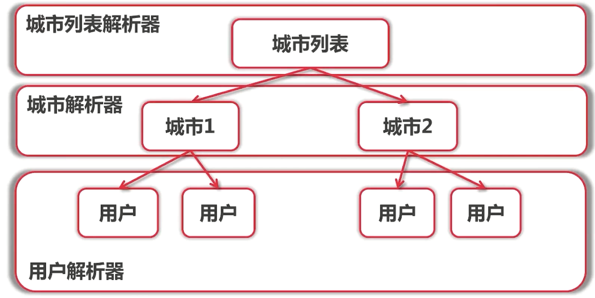
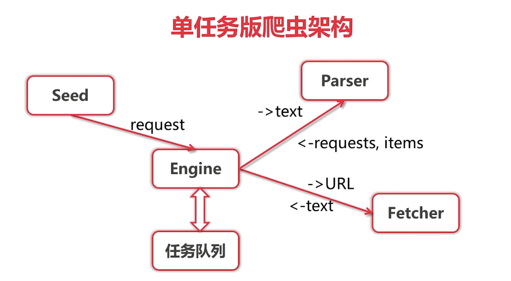

##单任务版爬虫的架构
来源于慕课网的Golang课程，爬取相亲网站（珍爱网）的用户信息
###1. 爬虫总体算法

总体分为三个层级，每个层级分别有一个该层级的解析器，通过该解析器来获取下一层级锁需要的信息，最终得到我们想要的结果。
可以看到通过城市列表解析器解析我们的种子页面（城市列表页面），可以拿到每个城市的信息，每个城市都有相应的城市解析器，之后再通过城市解析器解析城市页面的信息，从而拿到该城市用户的信息，每个用户也有对应的用户解析器，再通过用户解析器拿到每个用户的具体信息。

###2. 单任务版爬虫架构
[爬虫运行入口](main.go)

#####2.1 [Request](engine/types.go)
Request格式：{URL，对应解析器}
#####2.2 [Parser](zhenai/parser)
解析器，输入：utf-8编码的html文本文件；输出：Request列表，Item列表。接收由Engine传入的html文本文件，通过解析该文本文件得到下一层级的Request{URL，Parser}，再将Request交给Engine，如此反复最终得到items（用户信息）
######2.2.1 [城市列表解析器](zhenai/parser/citylist.go)
######2.2.2 [城市列表解析器单元测试](zhenai/parser/citylist_test.go)
######2.2.3 [正则表达式学习代码](regex/main.go)
#####2.3 Seed
种子页面
#####2.4 [Fetcher](fetcher/fetcher.go)
从网络上获取数据的模块，输入：URL；输出：utf-8编码的html文本文件。接收由Engine传入的URL，拿到网页的html文本文件，再进行转utf-8编码操作，最终向Engine返回utf-8编码的html文件
#####2.5 [Engine](engine/engine.go)
接收由Seed/Parser传来的Request，Engine并不是马上做的，而是将Request加入到任务队列中去，将所有的Request维护起来。对应维护的任务队列，不断的从中取出Request来执行；拿到Request之后首先将Request中的URL取出来送给Fetcher模块，经过Fetcher处理返回html文本文件，Engine获取文本之后将文本交由Parser，经过Parser处理再将得到的Request + items 返回给Engine......

